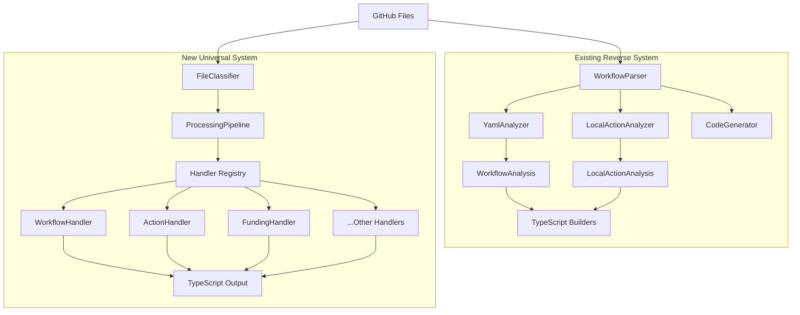

# Parsing Architecture

Flughafen includes two complementary parsing systems for handling GitHub files:

1. **Reverse Engineering System** - Specialized for converting GitHub workflows/actions → TypeScript builders
2. **Universal Parsing System** - Comprehensive GitHub file classification and processing

## System Overview



## Directory Structure

```
src/
├── operations/reverse/              # 🔒 Existing - Untouched
│   ├── workflow-parser.ts          # Main reverse orchestrator
│   ├── yaml-analyzer.ts            # Workflow YAML → Analysis
│   ├── local-action-analyzer.ts    # Action YAML → Analysis
│   ├── code-generator.ts           # Analysis → TypeScript
│   └── __tests__/                  # Comprehensive test suite
│
├── parsing/                        # 🆕 New Universal System
│   ├── classification/             # File type detection
│   │   ├── file-classifier.ts      # Main classification engine
│   │   ├── discriminators/         # Modular detection logic
│   │   │   ├── path-discriminator.ts
│   │   │   ├── basename-discriminator.ts
│   │   │   └── schema-discriminator.ts
│   │   └── __tests__/
│   │
│   ├── handlers/                   # GitHub file processors
│   │   ├── base-handler.ts         # Abstract base class
│   │   ├── workflow-handler.ts     # GitHub Actions workflows
│   │   ├── action-handler.ts       # Local actions
│   │   ├── funding-handler.ts      # GitHub Sponsors
│   │   ├── dependabot-handler.ts   # Dependabot config
│   │   ├── template-handlers/      # Issue/PR/Discussion templates
│   │   ├── community-handlers/     # Community health files
│   │   └── __tests__/
│   │
│   ├── pipeline/                   # Processing orchestration
│   │   ├── processing-pipeline.ts  # Main pipeline
│   │   ├── in-memory-pipeline.ts   # Memory-only processing
│   │   ├── validation-pipeline.ts  # Validation-only mode
│   │   └── __tests__/
│   │
│   ├── schemas/                    # JSON schemas for validation
│   │   ├── workflow-schema.ts      # GitHub Actions workflow
│   │   ├── action-schema.ts        # Local action schema
│   │   ├── funding-schema.ts       # FUNDING.yml schema
│   │   └── __tests__/
│   │
│   └── types/
│       └── github-files.ts         # TypeScript types
```

## Reverse Engineering System (Existing)

### Purpose
Converts GitHub workflows and local actions into Flughafen's TypeScript builder APIs.

### Key Components

#### `WorkflowParser`
Main orchestrator for reverse engineering operations.

```typescript
const parser = new WorkflowParser();

// Process single workflow
const result = await parser.reverseWorkflow('workflow.yml');

// Process entire .github directory
const result = await parser.reverseGithub('.github/');
```

#### `YamlAnalyzer`
Parses GitHub workflow YAML files into structured analysis objects.

```typescript
const analyzer = new YamlAnalyzer();
const analysis = await analyzer.analyzeWorkflow('ci.yml');
// Returns: WorkflowAnalysis with triggers, jobs, actions, etc.
```

#### `LocalActionAnalyzer`
Parses local action.yml files into structured analysis objects.

```typescript
const analyzer = new LocalActionAnalyzer();
const analysis = await analyzer.analyzeLocalAction('action.yml');
// Returns: LocalActionAnalysis with inputs, outputs, runs, etc.
```

#### `CodeGenerator`
Generates TypeScript code from analysis objects using Flughafen's builder APIs.

```typescript
const generator = new CodeGenerator();
const code = generator.generateWorkflowFromData(workflowData, filename);
// Returns: TypeScript using WorkflowBuilder, JobBuilder, etc.
```

### Use Cases
- `flughafen reverse workflow.yml` - Convert single workflow
- `flughafen reverse .github/` - Convert entire repository
- Roundtrip validation - Ensure generated code produces identical YAML

## Universal Parsing System (New)

### Purpose
Comprehensive GitHub file classification, validation, and processing system supporting all GitHub file types.

### Key Features
- **File Classification** - Automatic detection of GitHub file types
- **Schema Validation** - JSON schema validation for all file types
- **Dual Processing** - File-based and in-memory processing
- **Validation-Only Mode** - Check files without code generation
- **Extensible Architecture** - Easy to add new GitHub file types

### File Classification

#### Discriminator Chain
Uses a prioritized chain of discriminators to classify files:

```typescript
export class FileClassifier {
  private discriminators = [
    new PathDiscriminator(),     // .github/workflows/ → gha-workflow
    new BasenameDiscriminator(), // FUNDING.yml → funding
    new SchemaDiscriminator()    // Content analysis fallback
  ];
}
```

#### Supported File Types
```typescript
type FileKind =
  | 'gha-workflow'        // .github/workflows/*.yml
  | 'gha-action'          // action.yml, .github/actions/*/action.yml
  | 'dependabot'          // .github/dependabot.yml
  | 'funding'             // .github/FUNDING.yml
  | 'codeowners'          // CODEOWNERS
  | 'issue-template'      // .github/ISSUE_TEMPLATE/*.yml
  | 'pr-template'         // .github/PULL_REQUEST_TEMPLATE/*.md
  | 'discussion-template' // .github/DISCUSSION_TEMPLATE/*.yml
  | 'contributing'        // CONTRIBUTING.md
  | 'code-of-conduct'     // CODE_OF_CONDUCT.md
  | 'security'           // SECURITY.md
  | 'support'            // SUPPORT.md
  | 'citation'           // CITATION.cff
  | 'unknown';
```

### Processing Pipeline

#### File-Based Processing
```typescript
const pipeline = new ProcessingPipeline();

// Register handlers
pipeline.registerHandler('gha-workflow', new WorkflowHandler());
pipeline.registerHandler('funding', new FundingHandler());

// Process file from disk
const result = await pipeline.processFile('workflow.yml', {
  inputDir: '.github',
  outputDir: './generated',
  patterns: ['*.yml'],
  skipValidation: false
});
```

#### In-Memory Processing
```typescript
// Process content without file I/O - perfect for validation
const result = await pipeline.processContent(
  '.github/workflows/ci.yml',
  workflowObject,
  {
    validateOnly: true,     // No code generation
    skipValidation: false   // Run schema validation
  }
);
```

### Handler System

#### Handler Interface
```typescript
interface KindHandler {
  schema?: JSONSchema7;                              // Validation schema
  emit(ast: unknown, context: FileContext): string; // Code generation
}
```

#### Example: Workflow Handler
```typescript
export class WorkflowHandler implements KindHandler {
  schema = {
    type: 'object',
    required: ['jobs'],
    properties: {
      name: { type: 'string' },
      on: { /* trigger definitions */ },
      jobs: { /* job definitions */ }
    }
  };

  emit(ast: unknown, context: FileContext): string {
    const workflow = ast as WorkflowConfig;
    return `
      // Generated from ${context.path}
      export const ${camelCase(workflow.name)}Data = ${JSON.stringify(workflow, null, 2)};

      export function create${pascalCase(workflow.name)}Workflow() {
        return new Workflow()
          .name('${workflow.name}')
          // ... fluent API calls
      }
    `;
  }
}
```

### Schema Validation

#### Validation Schemas
Each file type has a corresponding JSON schema for validation:

```typescript
// workflow-schema.ts
export const workflowSchema: JSONSchema7 = {
  type: 'object',
  required: ['jobs'],
  properties: {
    name: { type: 'string' },
    on: {
      oneOf: [
        { type: 'string' },
        {
          type: 'object',
          properties: {
            push: { /* ... */ },
            pull_request: { /* ... */ }
          }
        }
      ]
    }
  }
};
```

#### Validation Modes
```typescript
// Strict validation - treat warnings as errors
const result = await pipeline.processFile('workflow.yml', {
  strictValidation: true
});

// Validation only - no code generation
const result = await pipeline.processContent(path, content, {
  validateOnly: true
});

// Skip validation - fastest processing
const result = await pipeline.processFile('workflow.yml', {
  skipValidation: true
});
```

## System Comparison

| Feature | Reverse System | Universal System |
|---------|---------------|------------------|
| **Purpose** | YAML → TypeScript builders | Universal GitHub file processing |
| **File Types** | Workflows + Local Actions | All GitHub file types (13+) |
| **Processing** | File-based only | File + In-memory |
| **Validation** | Comprehensive workflow validation | JSON schema validation |
| **Output** | Flughafen builder code | Configurable via handlers |
| **Use Case** | `flughafen reverse` command | General GitHub file analysis |

## Integration Patterns

### Coexistence
Both systems work independently and can be used together:

```typescript
// Use reverse system for specialized workflow conversion
const reverseResult = await workflowParser.reverseWorkflow('ci.yml');

// Use universal system for comprehensive file analysis
const universalResult = await pipeline.processFile('ci.yml');
```

### Validation Integration
Universal system can provide validation for reverse system:

```typescript
// Validate before reverse engineering
const validation = await pipeline.processContent(path, content, {
  validateOnly: true
});

if (validation.success) {
  const result = await workflowParser.reverseWorkflow(path);
}
```

### Handler Reuse
Reverse system analyzers can be adapted as universal handlers:

```typescript
class UniversalWorkflowHandler implements KindHandler {
  private yamlAnalyzer = new YamlAnalyzer();

  async emit(ast: unknown, context: FileContext): Promise<string> {
    // Reuse existing analysis logic
    const analysis = await this.yamlAnalyzer.analyzeWorkflowFromContent(
      YAML.stringify(ast),
      context.path
    );

    // Generate code using existing generator
    return this.generateFromAnalysis(analysis);
  }
}
```

## Testing Strategy

### Comprehensive Test Coverage
- **Unit tests** for each component (discriminators, handlers, pipeline)
- **Integration tests** using real GitHub files from `/examples/`
- **Schema validation tests** for all file types
- **Round-trip tests** ensuring accuracy
- **Performance tests** for large file sets

### Test Data Sources
- Real-world examples from `/examples/real-world-examples/`
- Synthetic test cases for edge cases
- Schema compliance validation
- Cross-system consistency checks

## Migration & Adoption

### Phase 1: Foundation
- ✅ File classification system
- ✅ Basic handlers (workflow, action, funding)
- ✅ Processing pipeline
- ✅ Comprehensive testing

### Phase 2: Integration
- Schema validation system
- In-memory processing pipeline
- Template handlers (issue, PR, discussion)
- Community health file handlers

### Phase 3: Enhancement
- Performance optimization
- Advanced validation rules
- Custom handler registration
- CLI integration

## Future Considerations

### Extensibility
- Plugin system for custom handlers
- Dynamic schema loading
- Custom discriminator registration
- Handler composition patterns

### Performance
- Streaming processing for large repositories
- Parallel handler execution
- Caching strategies
- Incremental processing

### Validation
- Custom validation rules
- Semantic validation beyond schema
- Cross-file validation (e.g., action references)
- Progressive validation levels